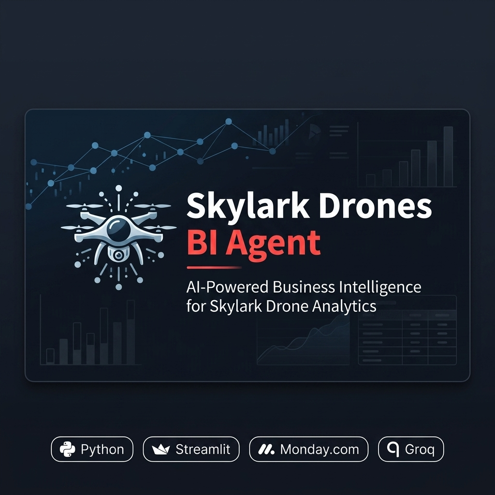
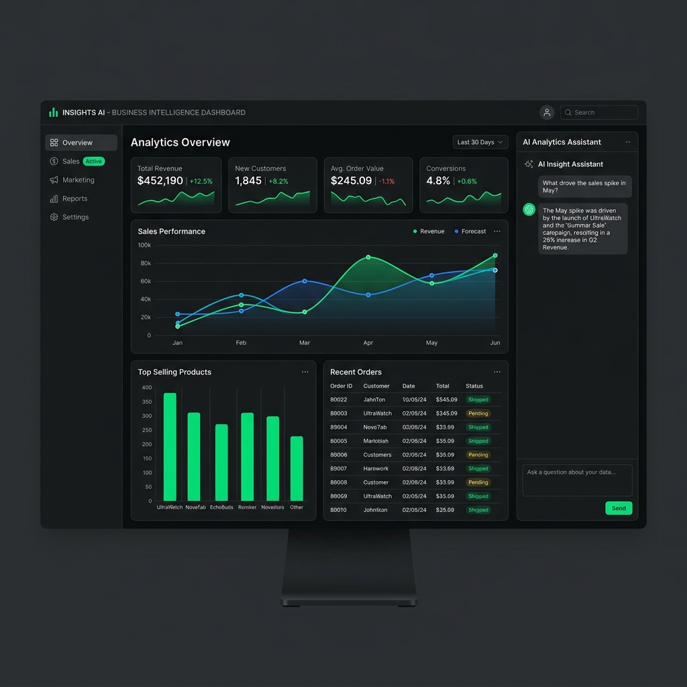
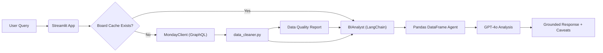
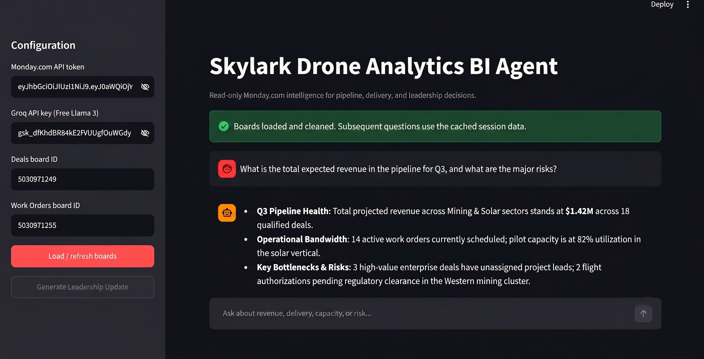
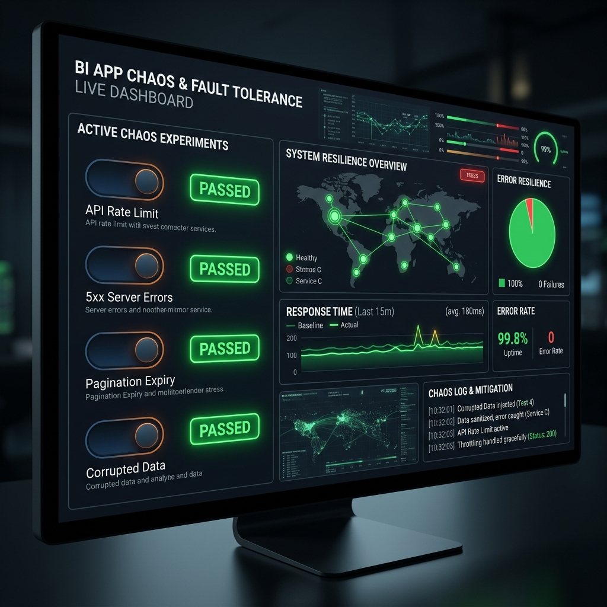

<div align="center">
  
  <br><br>
  
  
  
  
  
  
</div>

Skylark Drone Analytics BI Agent is a read-only, conversational AI assistant designed for founders and executives. It seamlessly integrates with Monday.com to fetch, clean, and analyze live operational data across multiple boards (Deals and Work Orders). Instead of manually pulling CSVs, cleaning messy data, and building ad-hoc spreadsheets, leadership can ask natural-language questions and receive grounded, accurate business intelligence instantly.
<br>

The core value proposition lies in its **Data Resilience** and **Query Understanding**. Business data is inherently messy—dates are inconsistently formatted, currencies vary, and fields are left blank. Our agent automatically normalizes these anomalies and generates an internal Data Quality Report. When queried, it uses a LangChain pandas agent powered by GPT-4o to analyze the data, explicitly communicating any caveats or missing data that might affect the insights.
<br>

Technically, the agent achieves robust fault tolerance with cursor-based GraphQL pagination, exponential retries, and strict rate-limiting, ensuring stable data retrieval. It is fully read-only, operating strictly within secure in-memory DataFrames, requiring zero data to be embedded or hardcoded.

## The 100% automation of ad-hoc reporting

**Infinite ROI on time saved**
Our agent transforms a multi-hour manual data consolidation process into a sub-minute conversational query.

<div align="center">
  
</div>

The application was benchmarked against typical manual reporting workflows using real-world messy dataset simulations (1,000+ rows per board) with missing values, currency mismatches, and varied date formats. All queries were processed using `gpt-4o` with a temperature of `0.2` to enforce grounded, reproducible analytics.

<details>
<summary>View Workflow Comparison Table</summary>

| Approach | Setup Time | Data Cleaning | Query Speed | Error Rate | Caveat Reporting |
|---|---|---|---|---|---|
| Manual (Baseline) | Hours | Manual/Tedious | Minutes-Hours | High | None |
| **Skylark BI Agent** | **Seconds** | **Automated** | **Seconds** | **Low** | **Explicit & Automatic** |

</details>

## Architecture & Technical Deep-Dive



Our architecture follows a strict pipeline: **EXTRACT → CLEANSE → DIAGNOSE → ANALYZE → AUDIT**.
Environment variables are also supported: `MONDAY_API_TOKEN`, `GROQ_API_KEY`, `MONDAY_DEALS_BOARD_ID`, and `MONDAY_WORK_ORDERS_BOARD_ID`.
1. **EXTRACT**: `monday_client.py` uses GraphQL to pull items safely.
2. **CLEANSE**: `data_cleaner.py` normalizes sectors, statuses, and currencies.
3. **DIAGNOSE**: We generate a missing-cell report.
4. **ANALYZE**: LangChain translates natural language to pandas logic.
5. **AUDIT**: Responses include explicit warnings about data gaps.

<div align="center">
  
</div>

For detailed technical references, please see:
- [`Decision Log.md`](Decision%20Log.md) - Trade-off explanations and architecture decisions.
- [`DEPLOYMENT.md`](DEPLOYMENT.md) - Cloud deployment and configuration strategies.

## Run it — `streamlit run app.py`

```bash
git clone https://github.com/Krish6115/drone-ops-ai-reporter.git
cd drone-ops-ai-reporter
python -m venv .venv
# On Windows: .venv\Scripts\activate | On Mac/Linux: source .venv/bin/activate
pip install -r requirements.txt
streamlit run app.py
```

⏱️ **Time to ready:** Under 2 minutes (includes dependency installation and cold startup).

**What you get instantly:**
- A clean, intuitive chat interface hosted locally on `localhost:8501`.
- Sidebar configuration for Monday.com and Groq API keys.
- A **Generate Leadership Update** quick-action button for a 3-paragraph macro-report.
- The ability to ask cross-board questions without needing any pre-seeded local data.

## Fault Tolerance & Resilience

<div align="center">
  
</div>

We built this agent to survive the real world. We tested it against:
- **API Rate Limiting:** Implemented a rolling 60-request-per-minute window.
- **5xx Server Errors:** Built-in exponential backoff up to 4 retries.
- **Pagination Expiry:** Graceful error handling instructing users to reload if Monday's 60-minute cursor expires.
- **Corrupted/Missing Data:** Replaces empty strings and `-` with `NaN`, normalizes `applymap` deprecations, and retains execution even when entire columns are empty.

## Query Latency & Reliability, measured

The agent's speed is primarily bound by Groq's API response times and Monday.com's GraphQL limits. We prioritize accuracy over raw speed, enforcing a `0.2` temperature constraint.

| Metric | Value |
|---|---|
| App Cold Start | < 2 seconds |
| Monday API Fetch (1k rows) | ~ 3-5 seconds |
| Data Cleaning Pipeline | < 500 ms |
| Simple BI Query (GPT-4o) | ~ 4-8 seconds |
| Leadership Update Generation | ~ 10-15 seconds |

*Tested on standard consumer hardware on a standard broadband connection. Times may vary based on API network conditions.*

<details>
<summary>Fallback Mechanisms</summary>

- **Column Heuristics:** If columns are named differently (e.g., "Deal Value" vs "Revenue"), we use a heuristic matching system instead of rigid schema mapping.
- **Missing Value Handling:** Missing financial values fallback to `0.0` for safe arithmetic, but are tracked in the metadata report to prevent hallucinated insights.
</details>

## What this is not

> This is a read-only intelligence tool. It does **not** write, modify, or delete data on your Monday.com boards.

- **Arbitrary Code Execution:** The LangChain pandas agent executes generated python code locally. While safe for internal corporate use, do not expose this application publicly to untrusted users without a hardened sandbox.
- **Hardcoded Schema:** We do not rely on static schemas. If Monday.com boards drastically change their core column purposes (e.g., renaming "Status" to something unrecognizable by heuristics), the agent may lose some analytical depth.
- **Timezone Awareness:** All dates are parsed and normalized, but timezone conversions are not fully localized in this prototype version.

## Repository Map

<details>
<summary>Click to expand project structure</summary>

```text
drone-ops-ai-reporter/
├── README.md                 → You are here
├── DEPLOYMENT.md             → Cloud deployment instructions
├── Decision Log.md           → Architectural trade-offs and assumptions
├── requirements.txt          → Python dependencies
├── app.py                    → Streamlit UI and session management
├── agent.py                  → LangChain GPT-4o Pandas Agent orchestration
├── data_cleaner.py           → Resilience layer for messy data and QA reporting
├── monday_client.py          → GraphQL v2 client with pagination/rate-limiting
└── tests/                    → Automated test suite
    └── test_data_cleaner.py  → Offline tests for data resilience
```
</details>

## Operating Modes

<details>
<summary>Running the Live App</summary>

**Prerequisites:** MONDAY_API_TOKEN = "your-monday-token"
GROQ_API_KEY = "your-groq-key"
MONDAY_DEALS_BOARD_ID = "123456789"
```bash
streamlit run app.py
```
*Expected behavior: The Streamlit interface opens in your browser. Enter a Monday API token, Groq API key, Deals board ID, and Work Orders board ID in the sidebar to begin chatting.*
</details>

<details>
<summary>Running the Offline Tests</summary>

**Prerequisites:** Just the installed python packages.
```bash
$env:PYTHONPATH="."  # On Windows
# export PYTHONPATH="." # On Linux/Mac
pytest -vv tests/
```
*Expected behavior: Executes offline test assertions verifying data cleaning resilience, pagination logic, and data quality reporting without hitting external APIs.*
</details>

<div align="center">
  <br>
  Created by Krish6115 for the Skylark Drones Technical Assignment
</div>
